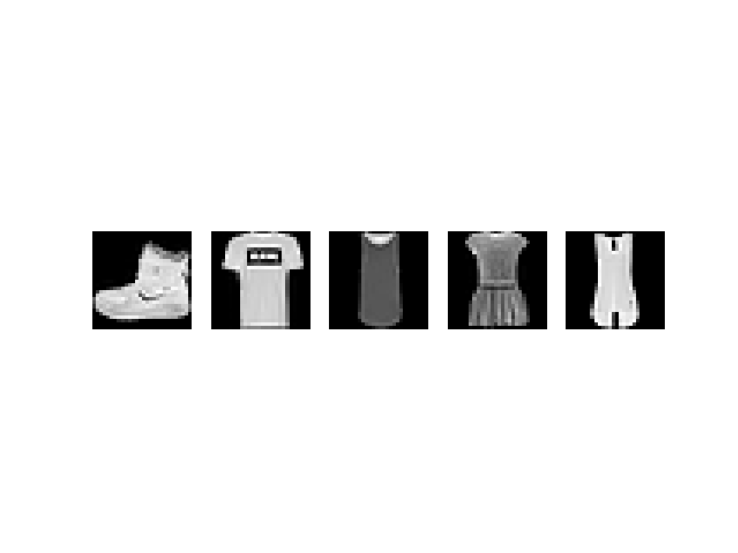
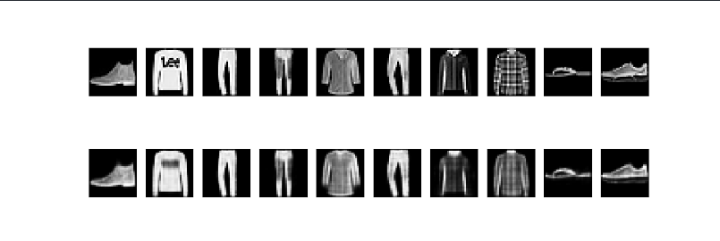

# Fashion MNIST Stacked Autoencoder & PSNR Analysis

This project implements an advanced **Stacked Autoencoder** using **TensorFlow** and **Keras** to perform image compression, denoising, and reconstruction on the **Fashion MNIST** dataset.

Built upon a foundational educational concept, this project optimizes the model architecture with a deeper structure, integrates **Early Stopping**, and utilizes **PSNR analysis**, successfully **reducing the loss rate by approximately 97%.**

## 🚀 Features and Improvements

Significant improvements made over the standard Autoencoder structure:

* **Deep Architecture:** The number of layers has been increased (256 -> 128 -> 64) to better represent complex features.
* **Early Stopping:** Integrated to prevent **overfitting** by monitoring validation loss and restoring the best weights once improvement stalls.
* **PSNR Analysis:** Model performance is evaluated not just by Loss values, but also by the **Peak Signal-to-Noise Ratio (PSNR)** to ensure visual fidelity.

## 📊 Performance Comparison

Optimization strategies resulted in a dramatic decrease in both training and validation loss:

| Metric | Previous State | **Current State (Optimized)** |
| :--- | :--- | :--- |
| **Training Loss** | 0.2620 | **0.0066** |
| **Validation Loss** | 0.2648 | **0.0069** |

## 📷 Visualization and Results

### 1. Dataset (Input)
The model was trained on the Fashion MNIST dataset, consisting of 10 different clothing categories.


### 2. Model Performance (Original vs. Reconstructed)
The image below demonstrates the model's ability to reconstruct unseen test data.
* **Top Row:** Original input images from the test set.
* **Bottom Row:** Reconstructed images output by the Autoencoder.

As observed, the detail loss is minimal, and the structural integrity of the objects is preserved.



### 3. Quality Metrics (PSNR)
Image quality was numerically analyzed using PSNR scores on the test set:
```text
Average PSNR: 22.45 dB
Std PSNR: 2.10 dB
Min PSNR: 15.30 dB
Max PSNR: 28.90 dB

🧠 Model Architecture
The model processes a 784 (28x28) dimensional input vector through a symmetric encoder-decoder structure:

Encoder:

Input (784) -> Dense(256, ReLU) -> Dense(128, ReLU) -> Latent Space (64)

Decoder:

Latent Space (64) -> Dense(128, ReLU) -> Dense(256, ReLU) -> Output (784, Sigmoid)

🛠️ Installation and Usage
Requirements
To run this project, you will need the following libraries:
pip install tensorflow numpy matplotlib

Running the Project
Clone the repository and run the main script:
git clone [https://github.com/HimmetDemir45/auto-encoders.git](https://github.com/HimmetDemir45/auto-encoders.git)
cd auto-encoders
python autoENcoders.py

👨‍💻 Author
Himmet

This project is open-source and developed for educational purposes.
